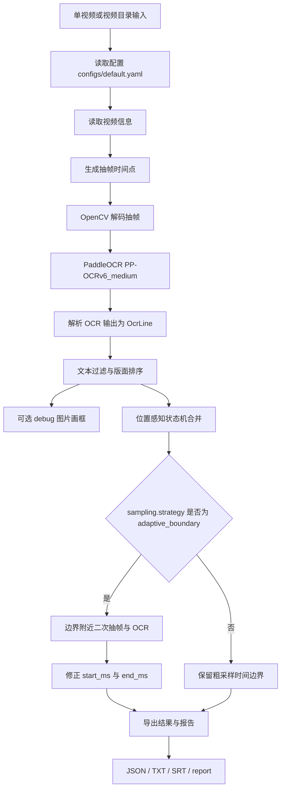
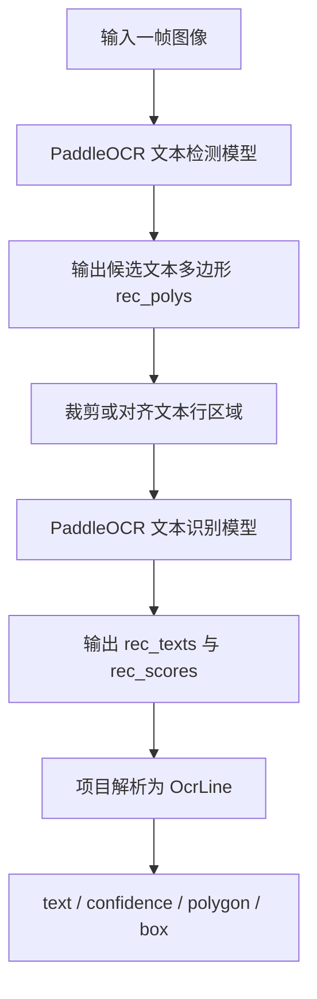
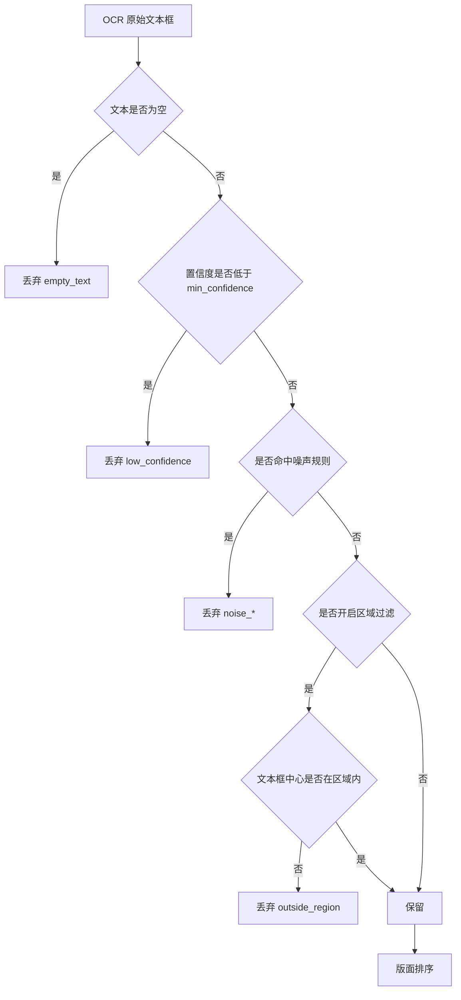
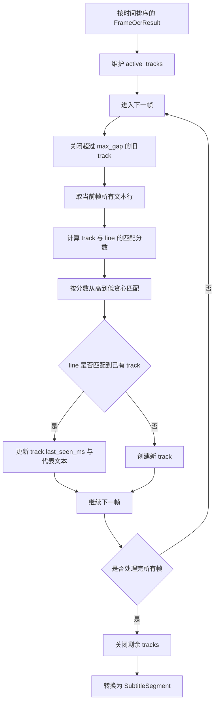
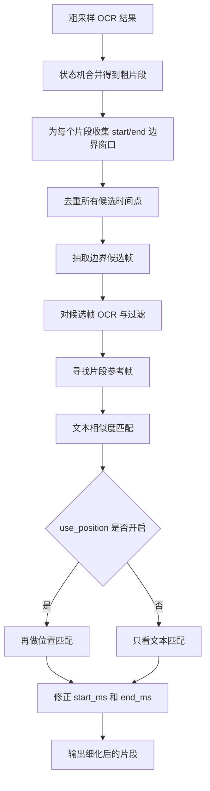

# 视频 OCR 项目流程方案总结

本文档总结当前项目的完整流程、模块职责、核心算法、模型使用方式、关键参数和后续优化方向。当前项目目标是：从视频中提取全画面出现过的文字，输出适合审核使用的 `JSON`、`TXT`、`SRT` 和运行报告。

当前阶段先做全画面文字提取。只提取字幕区域、字幕翻译替换、字幕区域专用检测等能力后续会作为独立方向继续做。

## 1. 当前项目定位

### 1.1 目标

输入一个视频或一个视频文件夹，程序按时间抽帧，对每帧调用 PaddleOCR 识别文字，过滤明显噪声，再把跨帧重复出现的文字合并为一段时间区间，最终导出：

- 每个抽帧点的信息：`*_sampled_frames.json`
- 每帧 OCR 文字、位置、置信度：`*_frame_ocr.json`
- 跨帧合并后的片段：`*_segments.json`
- 审核用纯文本：`*.txt`
- 审核用 SRT：`*.srt`
- 运行统计报告：`*_report.json`、`*_report.txt`
- 批量任务汇总：`batch_summary.json`、`batch_summary.txt`

### 1.2 当前技术路线

当前采用“现成 OCR 模型 + 规则后处理”的路线：

```text
视频输入
-> 视频信息读取
-> 抽帧
-> PaddleOCR 文本检测与识别
-> 文本过滤与版面排序
-> 位置感知跨帧合并
-> 自适应边界细化
-> 导出 JSON / TXT / SRT / 报告
```

这个路线的优点是清晰、可解释、容易测试，不需要训练模型。缺点是对图标误识别、极模糊文字、复杂动态花字等场景仍需要继续优化。

## 2. 总流程图



## 3. 模块职责总览

| 模块 | 职责 | 当前状态 |
| --- | --- | --- |
| `src/main.py` | 命令行入口，串联完整 pipeline | 主流程已完成 |
| `src/batch_runner.py` | 批量扫描视频、分目录输出、复制 SRT | 已完成 |
| `src/video_reader.py` | 读取视频 FPS、帧数、分辨率、时长 | 已完成 |
| `src/frame_sampler.py` | 按时间点抽帧，支持 seek、sequential、auto | 已完成 |
| `src/ocr_engine.py` | 封装 PaddleOCR 3.7，使用 PP-OCRv6_medium | 已完成 |
| `src/ocr_cache.py` | 相似帧 OCR 复用，默认关闭 | 可选功能 |
| `src/text_filter.py` | 过滤低置信度、噪声、区域外文字，并按版面排序 | 已完成基础版 |
| `src/debug_visualizer.py` | 在帧图上画 OCR 框和过滤结果 | 已完成 |
| `src/subtitle_merger.py` | 跨帧文本合并，默认状态机策略 | 已完成基础版 |
| `src/boundary_refiner.py` | 对合并片段的开始和结束时间做二次细化 | 已完成基础版 |
| `src/exporters.py` | 导出 JSON、TXT、SRT | 已完成 |
| `src/run_report.py` | 输出运行耗时、环境、配置、统计报告 | 已完成 |

## 4. 配置驱动的主流程

主配置文件是 `configs/default.yaml`。当前核心配置大致分为：

- `input`：默认输入视频路径
- `batch`：批量视频扩展名、是否递归、是否复制 SRT 回源目录
- `sampling`：抽帧策略、粗采样间隔、边界细化间隔、解码方式
- `ocr`：OCR 模型、设备、批大小、PaddleOCR 检测识别参数
- `ocr_cache`：相似帧复用策略
- `filter`：置信度、噪声、区域过滤
- `layout`：版面排序参数
- `debug`：是否保存画框图
- `merge`：跨帧合并策略、文本相似度、位置匹配参数
- `output`：输出目录和输出格式

配置驱动的好处是：算法逻辑不用频繁改代码，调准确率和速度时优先改 YAML。

## 5. 输入与批量管理

### 5.1 单视频输入

单视频由 `src/main.py` 处理。可以用命令行传入视频，也可以从配置读取：

```powershell
conda run -n ocr6 python -m src.main --video E:\OCR\test_vedio\1.mp4
```

### 5.2 批量输入

批量入口也是 `src/main.py`，当传入 `--video-dir` 时进入 `run_batch_pipeline`：

```powershell
conda run -n ocr6 python -m src.main --video-dir E:\OCR\test_vedio --output-dir E:\OCR\data\batch_outputs
```

批量流程做了几件事：

1. 根据扩展名查找视频文件。
2. 每个视频建立独立输出子目录，避免结果互相覆盖。
3. 复用同一个 PaddleOCR 引擎，减少重复加载模型的成本。
4. 每个视频执行完整 pipeline。
5. 可选把生成的 SRT 复制一份回源视频目录。
6. 输出批量汇总报告。

## 6. 视频信息读取

对应模块：`src/video_reader.py`

程序会先读取：

- 视频路径
- FPS
- 总帧数
- 宽高
- 总时长毫秒数

这些信息有三个作用：

1. 计算抽帧时间点。
2. 在报告里记录输入视频特征。
3. 给后续位置归一化、中心距离计算提供分辨率参考。

这里使用 OpenCV 的 `cv2.VideoCapture` 读取元信息。它不是最终工业级视频解码方案，但足够支撑当前学习型和 MVP 阶段。

## 7. 抽帧流程

对应模块：`src/frame_sampler.py`

### 7.1 抽帧的目的

视频本质上是连续图片序列。OCR 无法直接“读视频流中的所有文字”，所以需要先把视频按时间点转换成图片帧，再对图片做 OCR。

如果视频是 30 FPS，1 分钟就有 1800 帧。逐帧 OCR 成本太高，所以当前采用按时间间隔采样：

```text
0ms, 500ms, 1000ms, 1500ms, ...
```

当前默认：

```yaml
sampling:
  strategy: adaptive_boundary
  coarse_interval_seconds: 0.5
  refine_interval_seconds: 0.2
```

含义是：先每 0.5 秒做一次粗采样，再在文本片段边界附近用 0.2 秒做局部细化。

### 7.2 抽帧时间点生成算法

固定间隔采样算法很简单：

```text
step_ms = interval_seconds * 1000
timestamp = 0
while timestamp <= video_duration:
    timestamps.append(timestamp)
    timestamp += step_ms
```

优点：

- 简单稳定。
- 易于理解。
- 每个视频的 OCR 次数可预测。

缺点：

- 字幕或画面文字出现时间如果落在两个采样点之间，开始时间和结束时间会有延迟。
- 采样间隔越大，SRT 时间误差越大。
- 采样间隔越小，OCR 成本越高。

### 7.3 解码模式

当前支持三种：

| 模式 | 说明 | 适合场景 |
| --- | --- | --- |
| `seek` | 对每个时间点设置 `CAP_PROP_POS_MSEC` 后读取一帧 | 稀疏采样，当前默认 |
| `sequential` | 从头顺序读视频，遇到目标时间点就选最近帧 | 密集采样，减少随机定位 |
| `auto` | 根据采样密度自动选择 | 对不同视频做通用适配 |

当前默认使用：

```yaml
sampling:
  decode_mode: seek
```

原因是当前粗采样间隔为 0.5 秒，属于相对稀疏采样，随机定位通常比顺序读完整视频更合适。

### 7.4 抽帧图片质量

当前正式 OCR 流程默认：

```yaml
sampling:
  save_frame_images: false
  keep_frame_images_in_memory: true
  image_ext: png
```

这意味着：

- 抽帧图像直接保存在内存中送入 PaddleOCR。
- 默认不写磁盘图片，减少 I/O。
- 如果需要保存图片或 debug 图，使用 PNG，避免 JPEG 二次压缩带来的清晰度损失。

因此，当前 OCR 使用的帧通常不会比视频本身额外模糊。真正影响识别质量的主要因素是原视频编码质量、分辨率、运动模糊、文字尺寸和压缩噪声。

## 8. OCR 模型流程

对应模块：`src/ocr_engine.py`

### 8.1 使用的模型

当前使用 PaddleOCR 3.7 发布的 PP-OCRv6 medium：

```yaml
ocr:
  engine: paddleocr
  device: gpu:0
  text_detection_model_name: PP-OCRv6_medium_det
  text_recognition_model_name: PP-OCRv6_medium_rec
```

可以把 OCR 拆成两个子任务理解：

1. 文本检测：找出图片中哪些区域像文字，输出多边形框或矩形框。
2. 文本识别：把检测到的文字区域裁剪出来，识别成字符串。

也就是说，“文本框由谁负责识别”的答案是：PaddleOCR 的文本检测模型 `PP-OCRv6_medium_det` 负责找框；文本内容由文本识别模型 `PP-OCRv6_medium_rec` 负责读字。项目代码不自己训练检测框，而是解析 PaddleOCR 返回的 `rec_polys`、`rec_boxes`、`rec_texts` 和 `rec_scores`。

### 8.2 OCR 子流程图



### 8.3 文本检测算法的工程理解

PP-OCRv6 的内部网络结构由 PaddleOCR 管理，项目不手写模型。工程上可以这样理解文本检测：

1. 模型先对整张图做特征提取。
2. 在特征图上判断哪些像素区域属于文字。
3. 根据阈值把概率图转成候选文本区域。
4. 对候选区域做轮廓提取、扩张和框生成。
5. 输出文本框、多边形和检测分数。

项目中最相关的检测参数是：

| 参数 | 作用 | 调大或调小的影响 |
| --- | --- | --- |
| `text_det_limit_side_len` | OCR 输入长边限制 | 越大越能保留小字细节，但更慢 |
| `text_det_limit_type` | 限制方式，当前为 `max` | 控制按长边还是短边缩放 |
| `text_det_thresh` | 像素级文本概率阈值 | 越低越容易找小字，也更容易把图标当文字 |
| `text_det_box_thresh` | 文本框平均分阈值 | 越高越保守，误检更少，但可能漏模糊字 |
| `text_det_unclip_ratio` | 文本框扩张比例 | 越大框越宽，模糊字更完整，也可能粘连背景 |

当前配置：

```yaml
ocr:
  text_det_limit_side_len: 960
  text_det_limit_type: max
  text_det_thresh: 0.25
  text_det_box_thresh: 0.6
  text_det_unclip_ratio: 2.0
```

这套配置比极端召回配置更保守，目标是在模糊视频里尽量保留文字，同时减少图标和 UI 纹理误识别。

### 8.4 文本识别算法的工程理解

识别模型拿到检测框之后，会把文字区域变成适合识别的图像块，再输出字符序列。工程上可以理解为：

```text
文本行图片 -> 特征提取 -> 序列建模 -> 字符解码 -> 文本 + 置信度
```

项目中最相关的识别参数是：

| 参数 | 作用 |
| --- | --- |
| `text_rec_score_thresh` | PaddleOCR 内部识别分数阈值 |
| `text_score_threshold` | 项目解析 OCR 结果时的后置分数阈值 |
| `filter.min_confidence` | 项目过滤阶段最终保留阈值 |

当前配置中：

```yaml
ocr:
  text_rec_score_thresh: 0.3
  text_score_threshold: 0.0
filter:
  min_confidence: 0.65
```

含义是：PaddleOCR 识别阶段先做一个较低阈值过滤，项目后处理阶段再用 `filter.min_confidence` 做更明确的保留判断。

### 8.5 OCR 批处理

当前支持：

```yaml
ocr:
  batch_size: 8
```

当批大小大于 1 且 OCR 缓存未开启时，程序会把多个抽帧图像组成列表传给：

```python
ocr.predict(inputs, **predict_kwargs)
```

批处理的意义：

- GPU 一次前向处理多张图，吞吐更高。
- 减少 Python 循环调用开销。
- 对完整视频处理速度更友好。

代价：

- 单次显存占用更高。
- 如果视频分辨率很高，过大的 batch 可能导致显存不足。

## 9. OCR 结果数据结构

对应模块：`src/models.py`

PaddleOCR 返回的结果会被转换成项目统一结构：

```text
OcrLine:
  text: 识别出的文本
  confidence: 识别置信度
  polygon: 文本多边形
  box: 矩形外接框 [x1, y1, x2, y2]
```

一帧图像的 OCR 结果：

```text
FrameOcrResult:
  frame_index
  timestamp_ms
  image_path
  width
  height
  lines: list[OcrLine]
```

最终合并后的片段：

```text
SubtitleSegment:
  start_ms
  end_ms
  text
  confidence
```

虽然类名仍叫 `SubtitleSegment`，但当前项目含义已经扩展为“画面文字时间片段”，不只代表字幕。

## 10. 文本过滤

对应模块：`src/text_filter.py`

### 10.1 过滤流程



### 10.2 当前过滤规则

当前支持：

- 空文本过滤：`empty_text`
- 低置信度过滤：`low_confidence`
- 纯符号过滤：`noise_symbol_only`
- 重复标点过滤：`noise_repeated_punctuation`
- 纯数字过滤：`noise_numeric_only`，默认关闭
- 区域外过滤：`outside_region`，当前全画面提取默认关闭

当前配置：

```yaml
filter:
  min_confidence: 0.65
  noise:
    enabled: true
    min_text_length: 1
    drop_symbol_only: true
    drop_repeated_punctuation: true
    drop_numeric_only: false
  text_region:
    enabled: false
```

### 10.3 图标误识别为什么没被完全过滤

例如图标被识别成 `3.keep`，原因是：

1. 它不是空文本。
2. 它包含字母和数字，不属于纯符号。
3. 它不是重复标点。
4. 如果置信度达到或接近阈值，就可能被保留。
5. 当前没有“图标视觉特征过滤器”，也没有训练一个专门区分图标和文字的模型。

所以现阶段只能通过这些方式减少：

- 提高 `filter.min_confidence`
- 提高 `ocr.text_det_box_thresh`
- 提高 `ocr.text_rec_score_thresh`
- 增加短文本、异常字符组合、低置信度短 token 的规则过滤
- 后续引入图标/Logo/非文本检测或 ROI 分类

当前项目仍优先保证文字召回，不会过早加入复杂模型。

## 11. 版面排序

对应模块：`src/text_filter.py`

OCR 返回的文本框顺序不一定符合人阅读的顺序。项目使用一个简单版面排序算法：

1. 取每个文本框的中心点。
2. 统计文本框高度的中位数。
3. 计算行聚类阈值：

```text
row_threshold = max(8, median_line_height * row_tolerance)
```

4. 按 `center_y` 从上到下分行。
5. 同一行内按 `x_min` 从左到右排序。
6. 没有位置框的文本放在最后。

当前配置：

```yaml
layout:
  sort_lines: true
  row_tolerance: 0.6
```

这个算法不是复杂版面分析模型，但对常见横排视频文字、页面文字和字幕都比较直观。

## 12. 可视化 debug 画框

对应模块：`src/debug_visualizer.py`

当开启：

```yaml
debug:
  enabled: true
```

程序会输出画框图片，用于观察：

- PaddleOCR 找到了哪些框。
- 哪些框被保留。
- 哪些框被过滤。
- 区域过滤是否生效。

debug 的价值很高，因为 OCR 问题往往不是单纯“识别错”，而可能是：

1. 检测框根本没找到文字。
2. 检测框找到了但框偏了。
3. 识别模型读错。
4. 后处理把正确文本过滤掉了。
5. 后处理保留了图标误识别。

debug 图片可以把这些问题拆开观察。

注意：批量完整测试时建议关闭 debug，因为写大量图片会显著增加 I/O 时间。

## 13. 跨帧合并

对应模块：`src/subtitle_merger.py`

### 13.1 为什么需要合并

同一段文字会连续出现在多个抽帧点。例如一条文案从 1 秒显示到 5 秒，0.5 秒抽帧会得到：

```text
1.0s: limit
1.5s: limit
2.0s: limit
...
5.0s: limit
```

如果不合并，SRT 里会出现大量重复文本。合并后应该得到：

```text
00:00:01,000 --> 00:00:05,500
limit
```

结束时间通常会加上一个抽帧间隔，因为最后一次看到文字的时间点并不一定是文字消失时间。

### 13.2 当前默认策略：line_state_machine

当前默认：

```yaml
merge:
  strategy: line_state_machine
  use_position: true
```

状态机的核心思想是：把每个 OCR 文本框看作一个可以被跟踪的对象。只要后续帧中出现“文本相似、位置接近”的文字，就认为它属于同一个 track。

### 13.3 状态机流程图



### 13.4 文本相似度算法

项目中的 `text_similarity` 使用两种相似度，取较大值：

1. 字符序列相似度：`difflib.SequenceMatcher`
2. 多行集合相似度：行集合 Jaccard 比例

简化理解：

```text
sequence_score = 字符编辑层面的相似度
line_score = 相同行集合数量 / 总行集合数量
final_score = max(sequence_score, line_score)
```

这样做的原因是：

- OCR 可能有少量错字，不能要求完全一致。
- 多行文字的行顺序或局部识别可能变化，集合相似度更稳。

### 13.5 位置匹配算法

当前使用两种位置判断：

1. IoU：两个文本框重叠比例。
2. 归一化中心点距离：两个框中心点在画面中的相对距离。

只要满足其中一种，就认为位置接近：

```text
box_iou >= line_iou_threshold
或
normalized_center_distance <= line_center_distance_threshold
```

当前默认：

```yaml
merge:
  line_iou_threshold: 0.3
  line_center_distance_threshold: 0.08
```

IoU 适合文字框稳定的情况。中心点距离适合 OCR 框大小有轻微抖动，但位置基本没变的情况。

### 13.6 匹配分数

当文本相似且位置接近时，状态机计算：

```text
score = text_score * 0.7 + position_score * 0.3
```

文字相似度权重更高，因为本项目是文本提取任务；位置是辅助约束，用来防止同一画面不同位置出现相似文字时被错误合并。

### 13.7 max_gap_seconds 的作用

当前默认：

```yaml
merge:
  max_gap_seconds: 1.5
```

它允许短暂漏检。比如某段文字连续存在，但某一帧 OCR 没识别出来，只要间隔没有超过 1.5 秒，状态机仍可继续合并到同一片段。

这对模糊视频很重要，因为 OCR 在个别帧漏检很常见。

## 14. 旧策略：snapshot 合并

项目仍保留 `snapshot` 策略：

```yaml
merge:
  strategy: snapshot
```

它把一整帧的过滤后文本合成一个大字符串，再比较相邻帧整体文本是否相似、位置是否匹配。

优点：

- 逻辑简单。
- 适合“整页文案基本不动”的场景。

缺点：

- 画面上多个文本块独立变化时，整体快照容易被干扰。
- 某个局部文字变化，会影响整帧合并。

所以当前默认改为 `line_state_machine`。

## 15. 自适应边界细化

对应模块：`src/boundary_refiner.py`

### 15.1 为什么需要边界细化

固定间隔抽帧会带来时间误差。比如每 0.5 秒抽一帧：

```text
真实出现: 1.23s
最近采样: 1.50s
```

那么 SRT 看起来就会略微延迟。这个问题不是 OCR 本身导致的，而是采样粒度导致的。

### 15.2 当前策略

当前使用：

```yaml
sampling:
  strategy: adaptive_boundary
  coarse_interval_seconds: 0.5
  refine_window_seconds: 0.5
  refine_interval_seconds: 0.2
```

含义：

1. 先每 0.5 秒粗采样。
2. 合并得到粗略文本片段。
3. 在每个片段的开始和结束附近，各取一个 0.5 秒窗口。
4. 用 0.2 秒间隔在边界窗口内二次抽帧。
5. 再 OCR 和匹配目标文本。
6. 用第一次匹配帧修正开始时间，用最后一次匹配帧修正结束时间。

### 15.3 边界细化流程图



### 15.4 细化匹配算法

细化阶段不是重新理解整个视频，而是判断某个候选帧是否还包含目标片段文本：

```text
候选帧文本与目标片段文本相似
并且
候选帧中文本框位置与参考帧位置匹配
```

文本匹配仍使用 `text_similarity`。位置匹配复用 `line_match_score`、IoU 和中心距离。

### 15.5 成本控制

边界细化会增加额外 OCR 次数，所以配置里有预算：

```yaml
sampling:
  refine_max_extra_ocr_frames: 80
```

如果完整视频片段很多，边界细化可能成为主要耗时来源。报告中的 `边界细化` 时间可以帮助判断是否需要调大或调小这个预算。

## 16. OCR 复用缓存

对应模块：`src/ocr_cache.py`

当前默认关闭：

```yaml
ocr_cache:
  enabled: false
```

它的思想是：如果相邻抽帧图像几乎没变化，就复用上一帧 OCR 结果，不再调用 PaddleOCR。

算法流程：

1. 把图像缩小为固定尺寸灰度图，例如 96 x 96。
2. 计算当前帧和上一帧的平均像素差。
3. 计算最大像素差。
4. 如果平均差和最大差都低于阈值，认为画面足够相似。
5. 克隆上一帧 OCR 结果，只更新时间戳和帧索引。

当前它会在以下情况下自动关闭：

- debug 开启，因为 debug 需要真实画框。
- OCR batch_size 大于 1，因为批处理和逐帧缓存逻辑冲突。
- 不保留内存帧，因为没有图像用于差分。

这个功能适合 PPT、录屏、静态广告页等画面变化很少的视频。

## 17. 导出结果

对应模块：`src/exporters.py`

### 17.1 JSON

`*_frame_ocr.json` 记录每帧原始识别后的结构化结果，适合调试：

```json
{
  "timestamp_ms": 1000,
  "lines": [
    {
      "text": "example",
      "confidence": 0.92,
      "box": [100, 200, 300, 240]
    }
  ]
}
```

`*_segments.json` 记录合并后的片段，适合程序后续消费。

### 17.2 TXT

`*.txt` 主要用于人工快速浏览所有提取到的文案。

### 17.3 SRT

`*.srt` 主要用于带时间线审核。虽然格式叫字幕，但当前内容是全画面文字片段，不限于字幕区域。

示例：

```srt
1
00:00:01,000 --> 00:00:05,500
limit
```

### 17.4 报告

对应模块：`src/run_report.py`

报告包含：

- 视频信息
- 抽帧数量
- OCR 行数
- 合并片段数
- 边界细化统计
- 耗时拆分
- 环境信息
- PaddleOCR 参数
- 输出文件列表

这个报告用于判断性能瓶颈。例如之前观察到 `边界细化` 占用很高，就能从报告中定位原因。

## 18. 当前性能瓶颈分析

当前最主要耗时通常来自：

1. PaddleOCR 模型推理。
2. 边界细化额外 OCR。
3. 视频随机 seek 抽帧。
4. debug 图片写盘。

已有优化：

- OCR engine 复用，批量模式不重复加载模型。
- 主 OCR 支持 batch。
- 默认不保存抽帧图片，减少 I/O。
- 边界细化候选时间点去重。
- 粗采样 OCR 结果在边界细化中复用。
- 状态机合并减少后续无意义重复片段。
- 运行报告记录每个阶段耗时。

仍可继续优化：

- 更智能的边界搜索，减少边界 OCR 数量。
- FFmpeg 顺序解码或硬解码，替代 OpenCV。
- ROI 裁剪与识别，减少整帧 OCR 成本。
- 图像增强或超分辨率，只对疑难帧启用。
- 图标误识别规则或轻量分类器。

## 19. 准确率相关关键点

### 19.1 召回率与误检的平衡

OCR 参数不能只追求“识别更多”。如果阈值太低，图标、纹理、背景边缘都可能被当成文字。

偏召回的配置：

```yaml
ocr:
  text_det_limit_side_len: 1280
  text_det_thresh: 0.2
  text_det_box_thresh: 0.45
filter:
  min_confidence: 0.5
```

偏精度的配置：

```yaml
ocr:
  text_det_limit_side_len: 960
  text_det_thresh: 0.25
  text_det_box_thresh: 0.6
  text_rec_score_thresh: 0.3
filter:
  min_confidence: 0.65
```

当前更接近第二种，希望减少图标和背景误识别。

### 19.2 模糊视频的处理思路

模糊视频中，建议按顺序排查：

1. 打开 debug，确认文字检测框是否找到了。
2. 如果框没找到，调低检测阈值或提高输入边长。
3. 如果框找到了但文字读错，考虑提高视频帧清晰度或做 ROI 增强。
4. 如果图标被误识别，优先提高框阈值和置信度阈值。
5. 如果时间延迟明显，优化采样间隔和边界细化。

## 20. 当前未做的能力

当前没有做：

- 自定义 YOLO 字幕检测模型。
- 压缩域 I 帧或运动矢量分析。
- FFmpeg NVDEC 硬解码。
- 独立调用 PaddleOCR detection-only 和 recognition-only。
- ROI 动态拼图批量识别。
- 图标与 Logo 专用视觉过滤模型。
- 字幕区域专用提取和翻译替换。

这些都是后续可扩展方向，但不属于当前阶段的主线。

## 21. 推荐运行命令

### 21.1 快速单视频测试

```powershell
conda run -n ocr6 python -m src.main --video E:\OCR\test_vedio\1.mp4 --max-frames 20
```

### 21.2 完整单视频测试

```powershell
conda run -n ocr6 python -m src.main --video E:\OCR\test_vedio\1.mp4 --output-dir E:\OCR\data\outputs
```

### 21.3 批量测试文件夹

```powershell
conda run -n ocr6 python -m src.main --video-dir E:\OCR\test_vedio --output-dir E:\OCR\data\batch_outputs
```

### 21.4 递归批量测试

```powershell
conda run -n ocr6 python -m src.main --video-dir E:\OCR\test_vedio --recursive --output-dir E:\OCR\data\batch_outputs
```

### 21.5 只抽帧不 OCR

```powershell
conda run -n ocr6 python -m src.main --video E:\OCR\test_vedio\1.mp4 --sample-only
```

### 21.6 单元测试

```powershell
conda run -n ocr6 python -m unittest discover -s tests
```

## 22. 当前方案总结

当前项目已经完成一个可运行的全画面视频文字提取 pipeline：

```text
视频 -> 抽帧 -> PP-OCRv6 检测识别 -> 过滤排序 -> 状态机合并 -> 边界细化 -> 导出
```

它的核心特点是：

- 使用 PaddleOCR PP-OCRv6_medium 保证基础 OCR 能力。
- 不训练模型，先用成熟 OCR 引擎跑通流程。
- 用配置控制准确率和速度。
- 用状态机做位置感知跨帧合并。
- 用边界细化降低固定抽帧造成的 SRT 延迟。
- 用报告量化性能和环境。
- 用 debug 图片定位检测、识别、过滤问题。

下一阶段最值得继续优化的是：

1. 图标误识别过滤。
2. 边界细化耗时优化。
3. 模糊帧增强或 ROI 局部增强。
4. FFmpeg 解码后端评估。
5. 后续单独做字幕区域项目。
